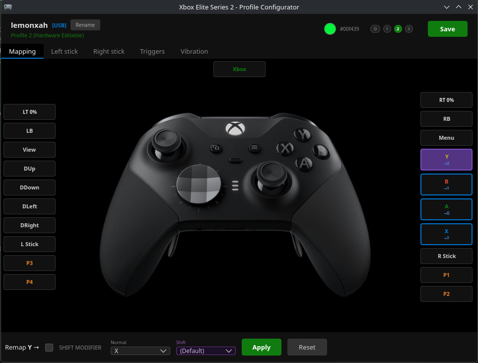

# xbelite2

Linux driver and configuration tool for the Xbox Elite Wireless Controller Series 2.



## What this does

The Xbox Elite 2 stores its configuration (button remaps, stick curves, dead zones, LED colors, vibration) directly on the controller hardware across 3 profiles. On Linux, the stock drivers (`xpad`, `hid-generic`) don't expose paddles properly, and there's no way to read or write the controller's hardware config without the Windows Xbox Accessories app.

This project gives you full control over the Elite 2 on Linux:

- A **kernel module** that registers the controller as a native Linux input device (like the standard xpad driver) with proper paddle support and automatic paddle suppression on hardware-remapped profiles
- **CLI tools** that read and write the controller's hardware profiles directly over the GIP protocol
- A **GUI** for live input display and profile management

**No background daemon required** - the controller works directly with games through the kernel's native input subsystem, with zero CPU overhead during gameplay.

## Components

| Component | Description |
|-----------|-------------|
| **xbelite2** (kmod) | DKMS kernel module. Registers controller as native Linux input device (`/dev/input/eventX`), handles paddle suppression, implements force-feedback. Also provides `/dev/xbelite2` (USB) and `/dev/xbelite2_bt` (BT) character devices for hardware configuration |
| **xbe2-rw** (CLI) | Reads and writes controller hardware config over USB: profiles, button remaps (normal + shift), LED colors, dead zones, stick curves, vibration, device name |
| **xbe2-bt** (CLI) | BT testing tool: rumble, raw report dumping |
| **xbelite2-gui** (GUI) | Qt6/QML app for live input display and profile management |

### What you can configure on the controller hardware

All configuration is stored on the controller itself and persists across reboots. Changes are made over USB via the GIP protocol using `xbe2-rw` or the GUI:

- Button remapping (normal and shift/alternate mode per profile)
- Profile LED colors (RGB)
- Stick dead zones and response curves
- Per-axis output saturation (trigger "hair trigger" / shortened-range behavior)
- Vibration motor intensity
- Device name (the Bluetooth advertised name)

### How profiles work

The Elite 2 has a physical profile switch with 4 positions:

- **Profile 0 (Default)** — no hardware remaps, paddles report as paddles
- **Profiles 1, 2, 3** — each has its own button remaps, curves, dead zones, and LED color stored on the controller

The controller handles all remapping in its firmware. When you remap a paddle to another button (e.g., P1 → A) in the hardware profile, pressing that paddle sends BOTH the paddle event AND the remapped button event. This would cause duplicate inputs in games.

**The kernel module solves this** by automatically suppressing paddle events on profiles 1-3 where remapping is configured. On profile 0 (default), all paddles work normally.

## Installation

### Arch Linux (AUR)

```bash
yay -S xbelite2-dkms
```

Installs the kernel module (DKMS), CLI tools, GUI, udev rules, and modprobe configuration.

**Note**: The package blacklists `hid_microsoft` and `xpad` to prevent driver conflicts. This only affects:
- `hid_microsoft`: Old quirky Microsoft devices from the 2000s (modern peripherals work with `hid-generic`)
- `xpad`: Generic Xbox controller driver (if you have non-Elite Xbox controllers, see manual setup instructions)

### From source

Requirements:
- Rust toolchain (stable)
- Linux kernel headers (for DKMS module build)
- Qt 6 with QtQuick/QML (`qt6-base`, `qt6-declarative`)

```bash
# Build and load kernel module
just kmod

# Build CLI tools and GUI
cargo build --workspace --release
```

### Manual setup

```bash
# Install udev rules and modprobe config
sudo cp 99-xbelite2.rules /etc/udev/rules.d/
sudo cp pkg/modprobe.d/xbelite2-blacklist.conf /etc/modprobe.d/
sudo udevadm control --reload-rules

# Load kernel module
sudo modprobe xbelite2
```

## Usage

### CLI tool (USB)

```bash
# Read controller info
sudo xbe2-rw read

# Read/write device name
sudo xbe2-rw name
sudo xbe2-rw name "my controller"

# Profile summary
sudo xbe2-rw profiles

# Profile detail (normal + shift mappings, curves, colors)
sudo xbe2-rw profile 1

# Set LED color
sudo xbe2-rw color 1 ff0000

# Button remapping (stored on controller hardware)
sudo xbe2-rw remap 1 A=B B=A          # swap A and B
sudo xbe2-rw remap-shift 1 A=LB       # A becomes LB in shift mode
sudo xbe2-rw remap-reset 1             # reset to default

# Per-motor rumble intensity (bytes 28-31 of the mapping page).
# Arguments: weak, strong, RT impulse, LT impulse (0-100). Any 0 silences
# that motor for rumble events while the profile is active.
sudo xbe2-rw rumble-intensity 1 100 100 100 100

# Vibration trim (bytes 49-50, semantics not fully nailed down)
sudo xbe2-rw vibration 1 48 48

# Per-axis saturation [LT LS RT RS] — the physical travel at which the
# output reaches max. 255 = full analog (default), lower = hair-trigger,
# 0 = binary (on/off only). If a profile ever ends up binary, this is why:
sudo xbe2-rw saturation 1              # read current values
sudo xbe2-rw saturation 1 255 255 255 255   # force full analog

# Rumble test
sudo xbe2-rw rumble 50 50 0 0
sudo xbe2-rw rumble-stop

# Stick curves
sudo xbe2-rw curves 1 reset

# Live LED preview
sudo xbe2-rw led 0000ff
sudo xbe2-rw led-off
```

### BT test tool

```bash
# Test rumble over Bluetooth
sudo xbe2-bt rumble 50 50 0 0
sudo xbe2-bt rumble-stop

# Dump raw BT HID reports
sudo xbe2-bt dump
```

### GUI

```bash
xbelite2-gui
```

## Architecture

```
Controller (BT/USB)
    |
    v
xbelite2.ko (kernel module)
    |
    +--> Native input device (/dev/input/eventX)
    |    |
    |    +--> Games (direct, zero latency)
    |    +--> Paddle suppression on profiles 1-3
    |    +--> Force-feedback (rumble) support
    |
    +--> /dev/xbelite2      (USB GIP ring buffer for config)
    +--> /dev/xbelite2_bt   (BT HID ring buffer for config)
         |
         v
    xbe2-rw / xbe2-bt / GUI
         |
         +--> Read/write hardware profiles
         +--> LED color, rumble test, device name
         +--> Button remaps, stick curves, dead zones
```

### Benefits

- **No daemon overhead** - Zero CPU/RAM usage during gameplay
- **Native input device** - Works with all Linux games that support gamepads
- **Lower latency** - Direct kernel-to-game input path
- **Automatic paddle suppression** - No duplicate inputs on profiles 1-3
- **Standard force-feedback** - Rumble works through Linux FF subsystem

### Workspace layout

```
xbelite2/
  kmod/         kernel module (C)
  gip/          shared GIP protocol library
  xbe2-rw/      USB CLI config tool
  xbe2-bt/      BT CLI test tool
  gui/          Qt6/QML GUI
  pkg/          Arch Linux packaging
  docs/         protocol documentation
```

## Protocol

See [docs/protocol.md](docs/protocol.md) for the reverse-engineered GIP protocol reference.

## License

GPL-2.0-only
